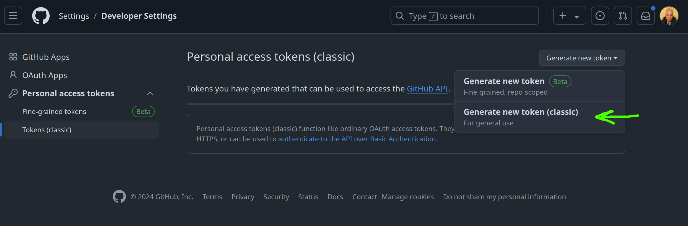
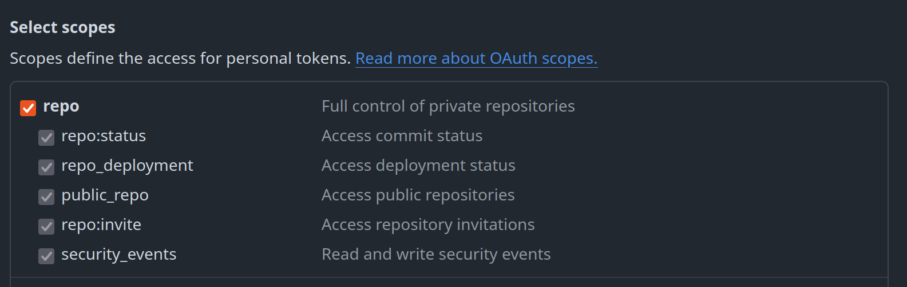

# CodeAnvil - GitHub Activity Tracker

**CodeAnvil** is the ultimate tool for tracking and visualizing GitHub activity across every repository in a user’s account. Whether you want to integrate it as a GitHub Action for automatic updates or run it as a standalone Python tool, CodeAnvil captures your “coding pulse,” activity heat, and consistency score to help visualize your GitHub habits. Perfect for developers, start-up founders, or anyone looking for insights into their coding patterns!

## Why Use CodeAnvil?

For developers passionate about productivity metrics, CodeAnvil offers detailed insights that go beyond basic statistics:

- **Pulse**: The “heartbeat” of your coding life, measuring average commit frequency.
- **Activity Heat**: An intensity gauge based on rolling commits, highlighting where your contributions shine (or slumber).
- **Consistency Score**: A measure of regularity in contributions, helping you or your team maintain steady progress.

## Usage Options

1. **[GitHub Action](#using-codeanvil-as-a-github-action)**: Automate CodeAnvil as a GitHub Action that generates activity metrics and updates your repository with an up-to-date activity plot.
2. **[Standalone Python Script](#using-codeanvil-as-a-standalone-python-tool)**: Run CodeAnvil locally with a Python script to generate a plot of your GitHub activity.

## Using CodeAnvil as a GitHub Action

With this setup, CodeAnvil will automatically generate an activity plot and commit it to your repository daily (or on a schedule you define). If you set it up in your **GitHub profile repository** (your `username/username` repository), the plot will be visible on your GitHub profile page, giving visitors a live view of your recent GitHub activity.

### Setup

1. **Create a Workflow File**: In your GitHub profile repository, create `.github/workflows/update-metrics.yml` with the following content:

   ```yaml
   name: Update GitHub Activity Plot

   on:
     schedule:
       - cron: "0 0 * * *"  # Runs daily, adjust as needed
     workflow_dispatch:  # Allows manual trigger

   jobs:
     update-activity:
       runs-on: ubuntu-latest

       steps:
         - name: Checkout Repository
           uses: actions/checkout@v2

         - name: Set up Python
           uses: actions/setup-python@v2
           with:
             python-version: "3.x"

         - name: Install Dependencies
           run: pip install requests pandas matplotlib numpy mplcyberpunk

         - name: Run CodeAnvil Activity Metrics
           env:
             USER_GITHUB: ${{ secrets.USER_GITHUB }}
             TOKEN: ${{ secrets.TOKEN GITHUB }}
           run: python script.py

         - name: Commit and Push Plot
           env:
             TOKEN GITHUB: ${{ secrets.TOKEN GITHUB }}
           run: |
             git config --global user.name "github-actions[bot]"
             git config --global user.email "41898282+github-actions[bot]@users.noreply.github.com"
             git add activity_plot.png
             git commit -m "Update GitHub activity metrics plot"
             git push
   ```

2. **Set GitHub Secrets**: Go to your repository’s **Settings > Secrets and variables > Actions** and add:
   - **`USER_GITHUB`**: Your GitHub username.
   - **`TOKEN GITHUB`**: A GitHub personal access token with `repo` and `read:user` permissions. For thorough details on how to generate the TOKEN jump to [Obtaining a GitHub Personal Access Token](#obtaining-a-github-personal-access-token)


3. **Embed the Plot in Your README**: Add the following line to your `README.md` to display the activity plot on your GitHub profile page:

   ```markdown
   
   ```

### Output

The GitHub Action will run daily (or as scheduled), automatically updating `activity_plot.png` in your repository with a fresh activity plot. This plot will appear in your profile repository README, creating a visual snapshot of your recent GitHub activity for visitors to see.

---

## Using CodeAnvil as a Standalone Python Tool

If you prefer to run CodeAnvil locally, follow these steps:

### Project Structure

```plaintext
./codeanvil/
├── src.py                    # Main logic for fetching, analyzing, and visualizing commit data
├── __init__.py               # Initializes CodeAnvil package
└── keys/
    ├── config.py             # Stores essential details like GitHub username and token
    └── __init__.py

./script.py                   # Entry point script to execute CodeAnvil
```

### Setup

1. **Install Dependencies**: Make sure Python is installed, then run:

   ```bash
   pip install -r requirements.txt
   ```

2. **Set Your GitHub Account Details**:
   - Open `codeanvil/keys/config.py`.
   - Replace `USER_GITHUB` with your GitHub username.
   - Optionally, add your GitHub token to `TOKEN` if you’re accessing private repositories.

### Obtaining a GitHub Personal Access Token

1. **Go to GitHub Settings**:
   - Navigate to [GitHub’s Personal Access Tokens page](https://github.com/settings/tokens).
   
2. **Generate New Token**:
   - Click **"Generate new token"** and take the plunge.



3. **Configure Token Permissions**:
   - Name your token (e.g., "CodeAnvil Master Key").
   - Select expiration and check `repo` and `read:user` scopes.




4. **Generate and Save the Token**:
   - Click **"Generate token"** and save it (seriously, you won’t see it again).
  
5. **Add Token to CodeAnvil**:
   - Paste your token into `codeanvil/keys/config.py` under `TOKEN`.

### Run CodeAnvil Locally

Once configured, you can run CodeAnvil by executing the script:

```bash
python script.py
```

### View Results

CodeAnvil will generate a plot of your recent GitHub activity and save it as `codeanvil_activity.png`. You can add this plot to your README, website, or presentations with:

```markdown

```

---

## Dependencies

CodeAnvil requires `requests`, `pandas`, `matplotlib`, and `numpy`. You can install these via the requirements file:

```bash
pip install -r requirements.txt
```

## License

Licensed under the MIT License. Control is good, but open-source control is even better!

