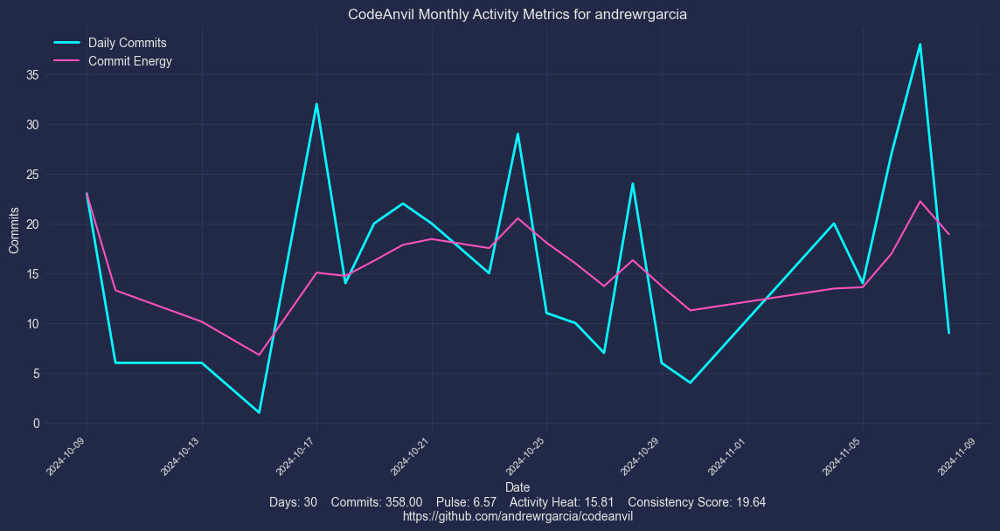
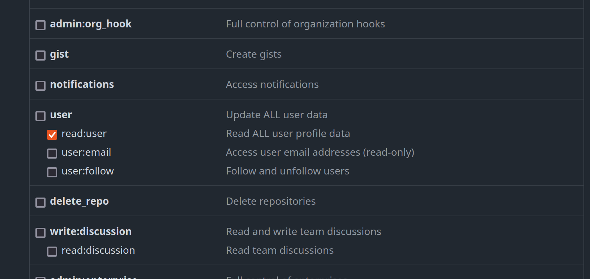

# CodeAnvil - The Micromanager's Dream for GitHub Activity Tracking

**CodeAnvil** is the ultimate Python tool for obsessively tracking and analyzing GitHub activity across every single repository in a user’s account. Why settle for vague productivity metrics when you can go deep? CodeAnvil captures your “coding pulse,” activity heat, and consistency score to visualize your GitHub habits. Great for start-up founders who *really* want to stay on top of things!

## Why Use CodeAnvil?

If you’re a developer with a penchant for stats (or a founder who believes every commit counts), CodeAnvil is here to help. You’ll see metrics like:

- **Pulse**: The “heartbeat” of your coding life. Track average commit frequency to know if your rhythm's more tortoise or hare.
- **Activity Heat**: An intensity gauge, based on rolling commits, that shows where your contributions truly shine (or slumber).
- **Consistency Score**: Who says you’re inconsistent? CodeAnvil reveals the regularity of your contributions so you can keep yourself—or your team—in check.



## Project Structure

```plaintext
./codeanvil/
├── src.py                    # Main logic for fetching, analyzing, and obsessing over commit data
├── __init__.py               # Initializes CodeAnvil package
└── keys/
    ├── config.py             # Stores essential details like GitHub username and token for enhanced micromanagement
    └── __init__.py

./script.py                   # Entry point script to execute CodeAnvil
```

## Setup

1. **Install Dependencies**: Got Python? Run:

   ```bash
   pip install -r requirements.txt
   ```

2. **Set Your GitHub Account Details**:
   - Open `codeanvil/keys/config.py`.
   - Replace `GITHUB_USER` with your GitHub username.
   - Optionally, add your GitHub token to `TOKEN` if you’re really dedicated (or need access to private repos).

### Obtaining a GitHub Personal Access Token

1. **Go to GitHub Settings**:
   - Navigate to [GitHub’s Personal Access Tokens page](https://github.com/settings/tokens).
   
2. **Generate New Token**:
   - Click **"Generate new token"** and take the plunge.


3. **Configure Token Permissions**:
   - Name your token (e.g., "CodeAnvil Master Key").
   - Select expiration and check `repo` and `read:user` scopes.




4. **Generate and Save the Token**:
   - Click **"Generate token"** and save it (seriously, you won’t see it again).
  
5. **Add Token to CodeAnvil**:
   - Paste your token into `codeanvil/keys/config.py` under `TOKEN`.

3. **Run CodeAnvil**:

   ```bash
   python script.py
   ```

4. **View Results**:
   - CodeAnvil will generate a visual snapshot of your coding activity, saved as `codeanvil_activity.png`.
   - Add it to your README, website, or startup pitch deck:

     ```markdown
     
     ```

## Dependencies

CodeAnvil requires `requests`, `pandas`, `matplotlib`, and `numpy`.

## License

Licensed under the MIT License because control is good—but open-source control is even better!

